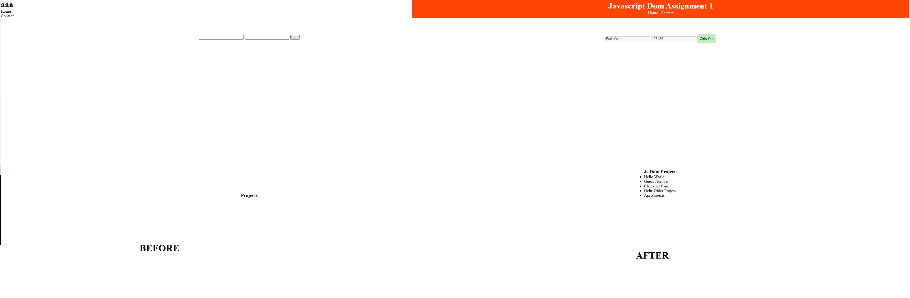

# JavaScript DOM Assignment

## Overview

This project demonstrates basic DOM manipulation techniques using JavaScript. The project involves styling elements, updating text content, handling user inputs, and dynamically modifying the DOM.

## Features

- Dynamic styling of header and button elements.
- Updating text content of various elements.
- Handling user inputs (username and password) and making them disabled.
- Displaying a list of projects dynamically.

## Technologies

- HTML5
- CSS3
- JavaScript

# JavaScript DOM Ataması

## Genel Bakış

Bu proje, JavaScript kullanarak temel DOM işleme tekniklerini göstermektedir. Proje, öğelerin stillendirilmesini, metin içeriğinin güncellenmesini, kullanıcı girişlerinin yönetilmesini ve DOM'un dinamik olarak değiştirilmesini içerir.

## Özellikler

- Başlık ve düğme öğelerinin dinamik stili.
- Çeşitli öğelerin metin içeriğinin güncellenmesi.
- Kullanıcı girişlerinin (kullanıcı adı ve şifre) işlenmesi ve devre dışı bırakılması.
- Projelerin listesini dinamik olarak görüntüleme.

## Teknolojiler

- HTML5
- CSS3
- JavaScript

[Canlı Demo'yu Deneyin](https://fatihycan.github.io/JavaScript-DOM-Assignment/)
